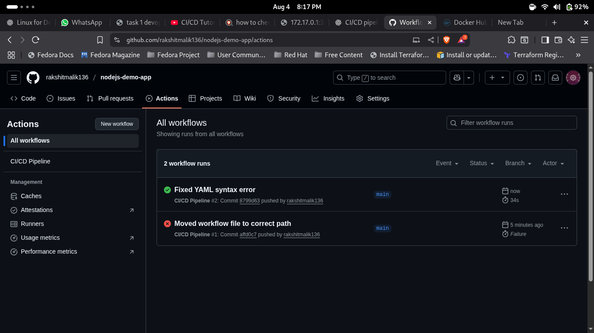
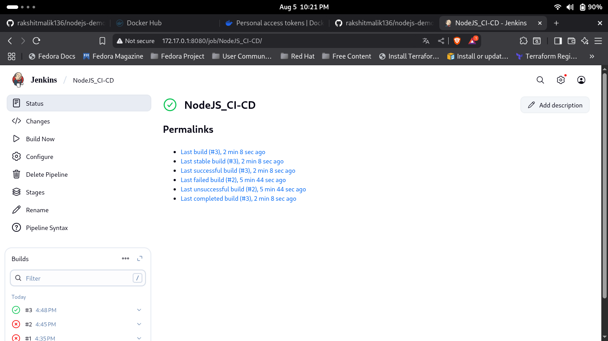

---
# Task-1
---

# 🚀 Automate Code Deployment Using CI/CD Pipeline (GitHub Actions)

## 📄 Objective
Set up a CI/CD pipeline to build and deploy a Node.js web app using **GitHub Actions** and **DockerHub**.

---

## 📁 Repository Link
[GitHub Repository](https://github.com/rakshitmalik136/nodejs-demo-app)

---

## ⚙️ Workflow File
Workflow file is located at: .github/workflows/main.yml

---

## 🐳 DockerHub Image
Docker image pushed automatically by CI/CD pipeline:
[DockerHub - nodejs-demo-app](https://hub.docker.com/r/rakshitmalik136/nodejs-demo-app)

---

## ✅ CI/CD Pipeline Status
- **Trigger:** On push to `main` branch
- **Jobs:**
  1. Checkout Code
  2. Setup Node.js
  3. Install Dependencies
  4. Run Tests (Skipped if none)
  5. Docker Build & Push to DockerHub

---

## 📸 Proof of Execution

### **GitHub Actions Successful Run**

---

## 🛠 How It Works
1. Code pushed to `main` triggers workflow
2. GitHub Actions checks out the code & installs dependencies
3. Docker image built & pushed to DockerHub
4. Application ready for deployment from DockerHub image

---
# Task-2
---

# 🚀 Create a Simple Jenkins Pipeline for CI/CD

## 📄 Objective
Set up a basic Jenkins pipeline to automate building and deploying a Node.js application using Docker and Jenkins.

---

## 📁 Repository Link
[GitHub Repository](https://github.com/rakshitmalik136/nodejs-demo-app)

---

## ⚙️ Jenkinsfile
Jenkinsfile is located at: Jenkinsfile

---

## 🐳 DockerHub Image
Docker image pushed automatically by Jenkins pipeline:
[DockerHub - nodejs-demo-app](https://hub.docker.com/r/rakshitmalik136/nodejs-demo-app)

---

## ✅ Jenkins Pipeline Configuration
- **Trigger:** On commit to `main` branch
- **Stages:**
  1. **Checkout** – Clone code from GitHub
  2. **Build** – Build Docker image
  3. **Test** – Run application tests (skipped if none)
  4. **Push** – Push Docker image to DockerHub
  5. **Deploy** – Deployment step (placeholder)

---

## 📸 Proof of Execution
### **1️⃣ Jenkins Pipeline Success**

---

## 🛠 How It Works
1. Developer pushes code to GitHub
2. Jenkins detects change (via webhook or poll SCM)
3. Jenkins pipeline runs:
   - Checkout source
   - Build Docker image
   - Push to DockerHub
4. Application is now available for deployment from DockerHub

---

## 👨‍💻 Maintainer
- **Rakshit Malik**
