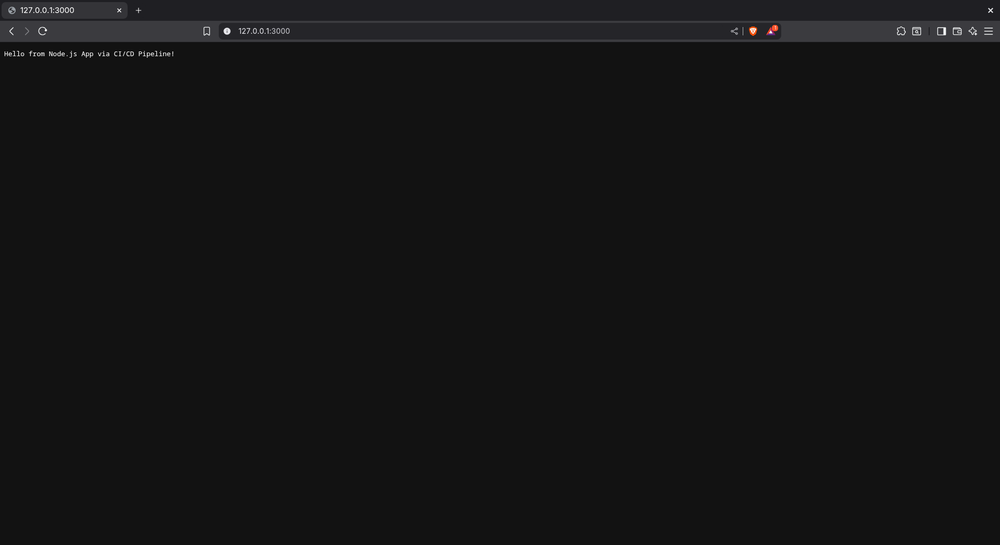

---
# Task-1
---

# 🚀 Automate Code Deployment Using CI/CD Pipeline (GitHub Actions)

## 📄 Objective
Set up a CI/CD pipeline to build and deploy a Node.js web app using **GitHub Actions** and **DockerHub**.

---

## 📁 Repository Link
[GitHub Repository](https://github.com/rakshitmalik136/nodejs-demo-app)

---

## ⚙️ Workflow File
Workflow file is located at: .github/workflows/main.yml

---

## 🐳 DockerHub Image
Docker image pushed automatically by CI/CD pipeline:
[DockerHub - nodejs-demo-app](https://hub.docker.com/r/rakshitmalik136/nodejs-demo-app)

---

## ✅ CI/CD Pipeline Status
- **Trigger:** On push to `main` branch
- **Jobs:**
  1. Checkout Code
  2. Setup Node.js
  3. Install Dependencies
  4. Run Tests (Skipped if none)
  5. Docker Build & Push to DockerHub

---

## 📸 Proof of Execution

### **GitHub Actions Successful Run**


---

## 🛠 How It Works
1. Code pushed to `main` triggers workflow
2. GitHub Actions checks out the code & installs dependencies
3. Docker image built & pushed to DockerHub
4. Application ready for deployment from DockerHub image

---
# Task-2
---

# 🚀 Create a Simple Jenkins Pipeline for CI/CD

## 📄 Objective
Set up a basic Jenkins pipeline to automate building and deploying a Node.js application using Docker and Jenkins.

---

## 📁 Repository Link
[GitHub Repository](https://github.com/rakshitmalik136/nodejs-demo-app)

---

## ⚙️ Jenkinsfile
Jenkinsfile is located at: Jenkinsfile

---

## 🐳 DockerHub Image
Docker image pushed automatically by Jenkins pipeline:
[DockerHub - nodejs-demo-app](https://hub.docker.com/r/rakshitmalik136/nodejs-demo-app)

---

## ✅ Jenkins Pipeline Configuration
- **Trigger:** On commit to `main` branch
- **Stages:**
  1. **Checkout** – Clone code from GitHub
  2. **Build** – Build Docker image
  3. **Test** – Run application tests (skipped if none)
  4. **Push** – Push Docker image to DockerHub
  5. **Deploy** – Deployment step (placeholder)

---

## 📸 Proof of Execution
### **1️⃣ Jenkins Pipeline Success**


---

## 🛠 How It Works
1. Developer pushes code to GitHub
2. Jenkins detects change (via webhook or poll SCM)
3. Jenkins pipeline runs:
   - Checkout source
   - Build Docker image
   - Push to DockerHub
4. Application is now available for deployment from DockerHub

---
# Task-3
---

# ☸️ Kubernetes Deployment

## 📄 Objective
Deploy the Node.js application on a Kubernetes cluster using Kind (Kubernetes in Docker) with proper resource management and service exposure.

---

## 🔧 Prerequisites
- Docker installed and running
- kubectl installed
- Kind installed ([Installation Guide](https://kind.sigs.k8s.io/docs/user/quick-start/))

---

## 🏗️ Kubernetes Architecture

### **Cluster Configuration**
- **Control Plane**: 1 node (kindest/node:v1.31.2)
- **Worker Nodes**: 2 nodes (kindest/node:v1.31.2)
- **Total Nodes**: 3 nodes

### **Application Resources**
- **Namespace**: `demo-app` (isolated environment)
- **Deployment**: 2 replicas for high availability
- **Service**: NodePort type for external access
- **Pod**: Individual pod configuration available

---

## 📁 Kubernetes Manifests Structure
```
k8s/
├── config.yml              # Kind cluster configuration
└── nodejs/
    ├── namespace.yml        # Namespace definition
    ├── deployment.yml       # Application deployment
    ├── service.yml         # Service exposure
    └── pod.yml             # Standalone pod (optional)
```

---

## 🚀 Deployment Steps

### **1️⃣ Create Kind Cluster**
```bash
# Create cluster using configuration
kind create cluster --config k8s/config.yml --name demo-cluster

# Verify cluster
kubectl cluster-info --context kind-demo-cluster
kubectl get nodes
```

### **2️⃣ Deploy Application**
```bash
# Create namespace
kubectl apply -f k8s/nodejs/namespace.yml

# Deploy application
kubectl apply -f k8s/nodejs/deployment.yml

# Expose service
kubectl apply -f k8s/nodejs/service.yml

# Verify deployment
kubectl get all -n demo-app
```

### **3️⃣ Access Application**
```bash
# Get service details
kubectl get svc -n demo-app

# Port forward for local access
kubectl port-forward -n demo-app service/demo-app-service 8080:3000

# Access application
curl http://localhost:8080
# Output: Hello from Node.js App via CI/CD Pipeline!
```

---

## 🎯 Resource Specifications

### **Deployment Configuration**
- **Image**: `rakshitmalik136/nodejs-demo-app:latest`
- **Replicas**: 2 (for load distribution)
- **Container Port**: 3000
- **Restart Policy**: Always (default)

### **Service Configuration**
- **Type**: NodePort
- **Target Port**: 3000 (container)
- **Service Port**: 3000
- **Protocol**: TCP

---

## 🔍 Monitoring & Troubleshooting

### **Check Deployment Status**
```bash
# View pods
kubectl get pods -n demo-app

# Describe deployment
kubectl describe deployment demo-app-deployment -n demo-app

# View logs
kubectl logs -l app=demo-app -n demo-app
```

### **Service Discovery**
```bash
# Test internal connectivity
kubectl run test-pod --image=busybox --rm -it --restart=Never -n demo-app \
  -- wget -qO- demo-app-service:3000
```

---

## 🔄 Scaling Operations

### **Scale Deployment**
```bash
# Scale up
kubectl scale deployment demo-app-deployment --replicas=5 -n demo-app

# Scale down
kubectl scale deployment demo-app-deployment --replicas=1 -n demo-app

# Auto-scale (if metrics-server is available)
kubectl autoscale deployment demo-app-deployment --cpu-percent=70 --min=2 --max=10 -n demo-app
```

---

## 🧹 Cleanup

### **Remove Application**
```bash
# Delete all resources
kubectl delete -f k8s/nodejs/

# Or delete namespace (removes everything)
kubectl delete namespace demo-app
```

### **Delete Cluster**
```bash
# Remove Kind cluster
kind delete cluster --name demo-cluster
```

---

## 📸 Proof of Execution
### **1️⃣ K8s deployment Success**


---

## 📊 Kubernetes Benefits Achieved

✅ **High Availability**: Multiple replicas ensure service continuity  
✅ **Load Distribution**: Traffic distributed across pods  
✅ **Self-Healing**: Automatic pod restart on failures  
✅ **Scalability**: Easy horizontal scaling  
✅ **Service Discovery**: Internal DNS resolution  
✅ **Resource Isolation**: Dedicated namespace  
✅ **Rolling Updates**: Zero-downtime deployments  

---

## 🔗 Integration with CI/CD

The Kubernetes deployment seamlessly integrates with the existing CI/CD pipelines:

1. **GitHub Actions/Jenkins** → Builds & pushes Docker image
2. **DockerHub** → Stores the container image
3. **Kubernetes** → Pulls and deploys the latest image
4. **Service** → Exposes application to users

---

## 👨‍💻 Maintainer
- **Rakshit Malik**

---

## 👨‍💻 Maintainer
- **Rakshit Malik**
