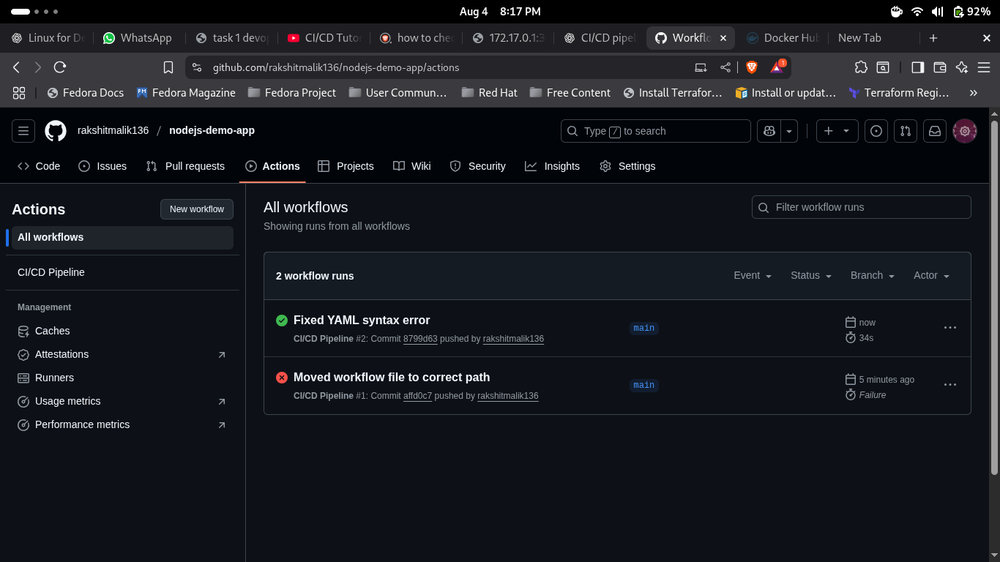

# 🚀 Automate Code Deployment Using CI/CD Pipeline (GitHub Actions)

## 📄 Objective
Set up a CI/CD pipeline to build and deploy a Node.js web app using **GitHub Actions** and **DockerHub**.

---

## 📁 Repository Link
[GitHub Repository](https://github.com/rakshitmalik136/nodejs-demo-app)

---

## ⚙️ Workflow File
Workflow file is located at: .github/workflows/main.yml

---

## 🐳 DockerHub Image
Docker image pushed automatically by CI/CD pipeline:
[DockerHub - nodejs-demo-app](https://hub.docker.com/r/rakshitmalik136/nodejs-demo-app)

---

## ✅ CI/CD Pipeline Status
- **Trigger:** On push to `main` branch
- **Jobs:**
  1. Checkout Code
  2. Setup Node.js
  3. Install Dependencies
  4. Run Tests (Skipped if none)
  5. Docker Build & Push to DockerHub

---

## 📸 Proof of Execution
### **GitHub Actions Successful Run**

---

## 🛠 How It Works
1. Code pushed to `main` triggers workflow
2. GitHub Actions checks out the code & installs dependencies
3. Docker image built & pushed to DockerHub
4. Application ready for deployment from DockerHub image

---

## 👨‍💻 Maintainer
- **Rakshit Malik**
